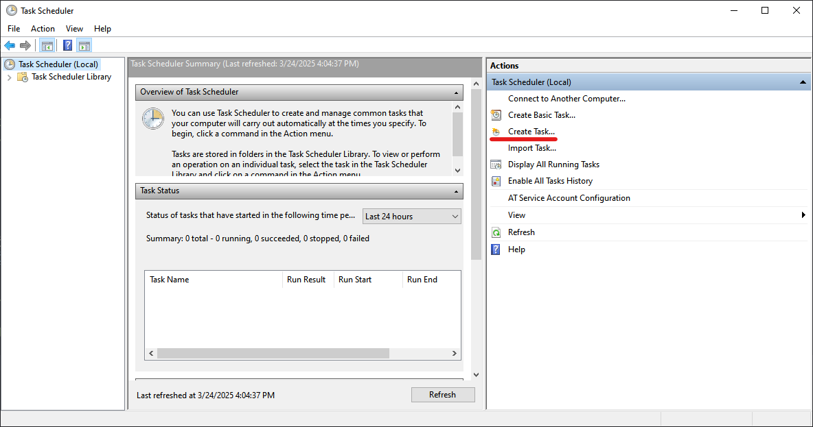
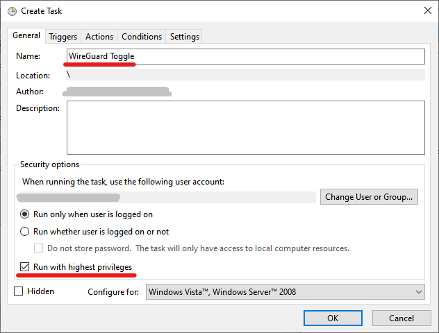
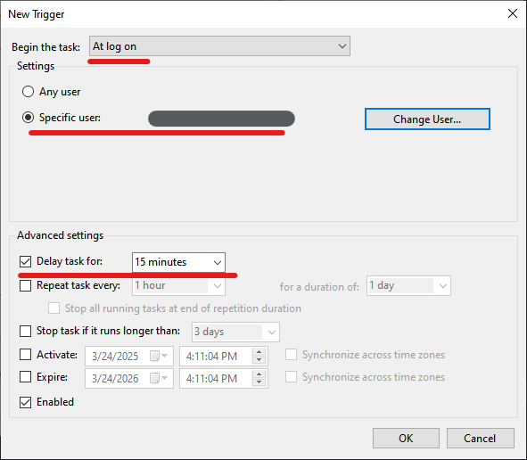
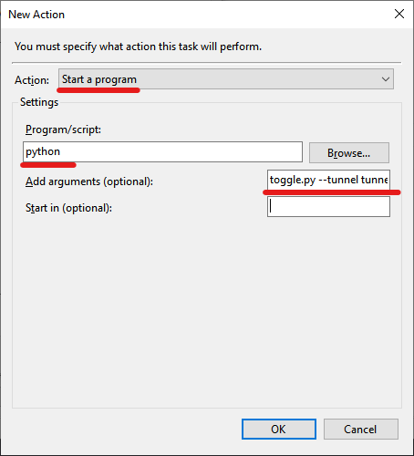
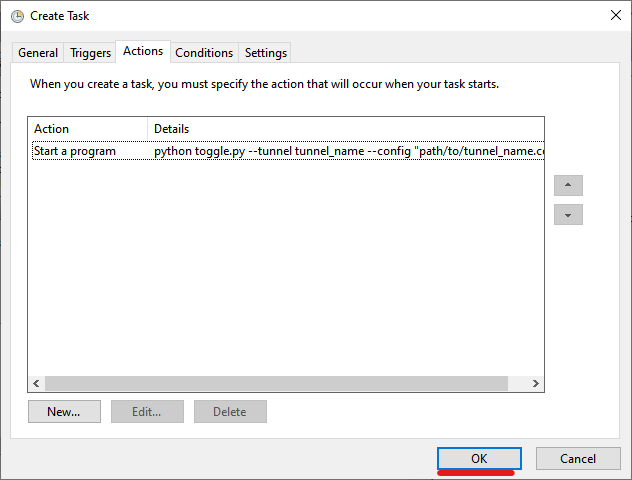

# WireGuard Tunnel Toggle

Create a custom hotkey that toggles WireGuard toggle on and off.

## Installation

Copy contents of toggle.py script to your local Windows PC and install the dependency.

```bat
pip install keyboard
```

or

```bat
git clone https://github.com/bissakov/wireguard-hotkey-toggle.git
cd wireguard-hotkey-toggle

python -m venv venv
venv/Scripts/activate
python -m pip install --upgrade pip
pip install -r .\requirements.txt
```

## Usage

### Batch script

Make sure to run the script with admin privileges.
[All available keyboard modifier names](https://github.com/boppreh/keyboard)

```bat
python toggle.py --tunnel tunnel_name --config "path/to/tunnel_name.conf" --hotkey "windows+c"
```

### Using Windows Task Scheduler

1. Create Task
2. General tab - Give a name and tick privileges box
3. Triggers tab - Create a trigger, change trigger type, select a specific user and give it a delay (optional)
4. Actions tab - Create an action, choose a type, fill program and argument fields
5. Press OK






